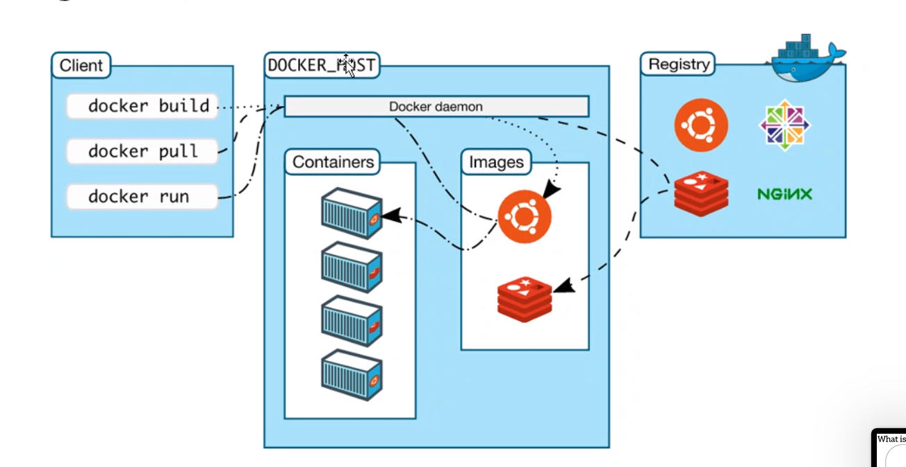
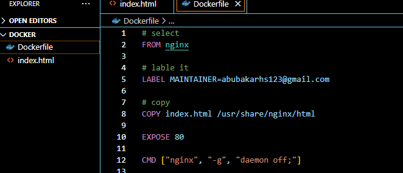
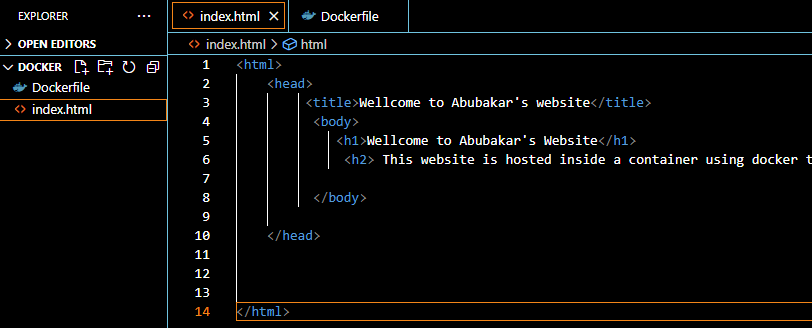

# docker
docker



## What is docker
Docker is a containerization platform that allows developers to package their applications, along with their dependencies and libraries, into a single unit called a container. Docker containers are lightweight, portable, and can run consistently across different computing environments, making it easier for developers to deploy and manage their applications.

## Why do we use docker
We use Docker to simplify the application deployment process and to ensure that our applications run consistently across different environments. Docker allows us to package our application code, runtime environment, and dependencies into a container image, which can be easily moved between different computing environments, such as development, testing, and production environments.

## How do we use docker?
To use Docker, we first need to install Docker on our local machine or server. Once installed, we can use the Docker command-line interface (CLI) to create and manage containers. We start by creating a Dockerfile, which specifies the instructions to build a container image. We then use the Docker CLI to build the image and run the container.

## WHen do we use docker?
We use Docker when we want to simplify the deployment process, improve application reliability, and increase scalability. Docker allows us to package our application code and dependencies into a single container, which can be easily deployed to different environments without worrying about compatibility issues.

## Who uses docker?
Docker is used by a wide range of organizations, from small startups to large enterprises, and by developers and IT professionals across different industries. It is particularly popular among DevOps and cloud computing professionals, who use Docker to manage and deploy applications in cloud-based environments.

## Benefits of docker

The key benefits of using Docker include:

1. Portability: Docker containers are highly portable, making it easy to move them between different environments, such as development, testing, and production.

2. Consistency: Docker ensures that applications run consistently across different environments, regardless of the underlying infrastructure or operating system.

3. Efficiency: Docker containers are lightweight, which means they require fewer resources to run than traditional virtual machines. This leads to faster deployment times and lower infrastructure costs.

4. Isolation: Docker containers provide a high level of isolation between applications, making it possible to run multiple applications on the same host without worrying about compatibility issues.

5. Security: Docker provides several security features, such as containerization and isolation, which help to prevent unauthorized access and protect the application from external threats.

6. Scalability: Docker makes it easy to scale applications up or down by adding or removing containers as needed.

7. Automation: Docker allows for the automation of the application deployment process, which can save time and reduce the risk of human error.

Overall, Docker provides a more efficient, reliable, and secure way to deploy and manage applications, making it an increasingly popular choice for developers and IT professionals.

## Difference between virtualization and containerization 

Virtualization and containerization are both technologies used to deploy and run applications, but they have some fundamental differences.

Virtualization is the process of creating a virtual version of an operating system, hardware, or network resources. Virtualization allows multiple operating systems to run on a single physical machine, each in its own isolated environment. Each virtual machine runs its own guest operating system, and the hypervisor provides the abstraction layer between the physical resources and the virtual machines.

On the other hand, containerization is a lightweight alternative to virtualization that allows multiple applications to run on a single operating system, each in its own isolated environment. Containers are created from a single operating system and share the same kernel, but each container has its own isolated file system, network, and resources.

The main differences between virtualization and containerization are:

1. Resource utilization: Virtualization uses more resources since each virtual machine requires its own operating system, while containerization shares the host operating system, which leads to better resource utilization.

2. Isolation: Virtual machines provide complete isolation between different guest operating systems, while containers share the same kernel, which provides a lower level of isolation.

3. Deployment time: Virtual machines can take longer to deploy since they require a complete operating system installation, while containers can be quickly deployed since they only require the container image to be downloaded and started.

4. Portability: Containers are highly portable since they can be easily moved between different environments, while virtual machines are less portable due to differences in hardware and underlying operating systems.

In summary, virtualization provides complete isolation between different operating systems, while containerization provides lightweight isolation between applications running on the same operating system. Virtualization is suitable for running multiple operating systems on a single machine, while containerization is suitable for running multiple applications on a single operating system.

## Docker architecture/api

Docker architecture consists of several components that work together to enable containerization and management of containerized applications. The main components of Docker architecture are:

- Docker Daemon: It is a background service that runs on the host machine and manages the containers. It communicates with the Docker client and performs tasks such as building, running, and managing containers.

- Docker Client: It is a command-line interface (CLI) tool that allows users to interact with the Docker daemon. The Docker client sends commands to the daemon to build, run, and manage containers.

- Docker Images: It is a read-only template that contains the application code, runtime environment, libraries, and dependencies required to run a container. Docker images can be built locally or downloaded from Docker Hub, a public repository of Docker images.

- Docker Containers: It is a running instance of a Docker image. Each container is isolated from the host machine and other containers, and has its own file system, network, and resources.

- Docker Registry: It is a service that stores Docker images. Docker Hub is a public registry maintained by Docker, but users can also set up their own private registry to store their own Docker images.

Docker also provides a RESTful API that allows developers to interact with the Docker daemon programmatically. The Docker API provides endpoints for managing containers, images, networks, volumes, and other Docker objects. Developers can use the Docker API to build custom tools and integrations that interact with the Docker daemon. The Docker API is also used by popular container orchestration platforms, such as Kubernetes and Docker Swarm, to manage containers at scale.

## Docker commands

```
Options:
      --config string      Location of client config files (default
                           "C:\\Users\\ashar\\.docker")
  -c, --context string     Name of the context to use to connect to the
                           daemon (overrides DOCKER_HOST env var and
                           default context set with "docker context use")
  -D, --debug              Enable debug mode
  -H, --host list          Daemon socket(s) to connect to
  -l, --log-level string   Set the logging level
                           ("debug"|"info"|"warn"|"error"|"fatal")
                           (default "info")
      --tls                Use TLS; implied by --tlsverify
      --tlscacert string   Trust certs signed only by this CA (default
                           "C:\\Users\\ashar\\.docker\\ca.pem")
      --tlscert string     Path to TLS certificate file (default
                           "C:\\Users\\ashar\\.docker\\cert.pem")
      --tlskey string      Path to TLS key file (default
                           "C:\\Users\\ashar\\.docker\\key.pem")
      --tlsverify          Use TLS and verify the remote
  -v, --version            Print version information and quit

Management Commands:
  builder     Manage builds
  buildx*     Docker Buildx (Docker Inc., v0.10.3)
  compose*    Docker Compose (Docker Inc., v2.15.1)
  config      Manage Docker configs
  container   Manage containers
  context     Manage contexts
  dev*        Docker Dev Environments (Docker Inc., v0.1.0)
  extension*  Manages Docker extensions (Docker Inc., v0.2.18)
  image       Manage images
  manifest    Manage Docker image manifests and manifest lists
  network     Manage networks
  node        Manage Swarm nodes
  plugin      Manage plugins
  sbom*       View the packaged-based Software Bill Of Materials (SBOM) for an imag
e (Anchore Inc., 0.6.0)
  scan*       Docker Scan (Docker Inc., v0.25.0)
  scout*      Command line tool for Docker Scout (Docker Inc., v0.6.0)
  secret      Manage Docker secrets
  service     Manage services
  stack       Manage Docker stacks
  swarm       Manage Swarm
  system      Manage Docker
  trust       Manage trust on Docker images
  volume      Manage volumes

Commands:
  attach      Attach local standard input, output, and error streams to a running c
ontainer
  build       Build an image from a Dockerfile
  commit      Create a new image from a container's changes
  cp          Copy files/folders between a container and the local filesystem
  create      Create a new container
  diff        Inspect changes to files or directories on a container's filesystem
  events      Get real time events from the server
  exec        Run a command in a running container
  export      Export a container's filesystem as a tar archive
  history     Show the history of an image
  images      List images
  import      Import the contents from a tarball to create a filesystem image
  info        Display system-wide information
  inspect     Return low-level information on Docker objects
  kill        Kill one or more running containers
  load        Load an image from a tar archive or STDIN
  login       Log in to a Docker registry
  logout      Log out from a Docker registry
  logs        Fetch the logs of a container
  pause       Pause all processes within one or more containers
  port        List port mappings or a specific mapping for the container
  ps          List containers
  pull        Pull an image or a repository from a registry
  push        Push an image or a repository to a registry
  rename      Rename a container
  restart     Restart one or more containers
  rm          Remove one or more containers
  rmi         Remove one or more images
  run         Run a command in a new container
  save        Save one or more images to a tar archive (streamed to STDOUT by defau
lt)
  search      Search the Docker Hub for images
  start       Start one or more stopped containers
  stats       Display a live stream of container(s) resource usage statistics
  stop        Stop one or more running containers
  tag         Create a tag TARGET_IMAGE that refers to SOURCE_IMAGE
  top         Display the running processes of a container
  unpause     Unpause all processes within one or more containers
  update      Update configuration of one or more containers
  version     Show the Docker version information
  wait        Block until one or more containers stop, then print their exit codes


```

key commands:

```
docker images - shows a list of images

docker run -d -p 80:80 <username>/<docker repo>

docker ps -a

docker start 

docker stop 

docker rm containerID -f

Execute an additional command in a container `docker exec -it containerID bash` `docker exec -it containerID sh`

# If this does not work run this command then use `alias docker="winpty docker"`

```

To navigate to the html file once in our docker container `cd /usr/share/nginx/html`

We should then be able to see our `index.html`

You won't be able to do anything with this until you:

```
apt update -y
apt upgrade-y

apt install nano
```

## How to push an image to your repo

```
docker ps # to fidn your images id

docker commit <id> <username>/<reponame>

docker tag <id> <username/repo>

docker push <username/reponame> # you can aslo put a tag at the end docker push <username/reponame>:v1
```

### Building a docker image

To build a docker image we need to create a Dockerfile





To build the image run the command:
```
docker build -t <username/repo> .

docker images
```

You can test it by running the image:

```
docker run -d -p 80:80 <username/repo>
```


